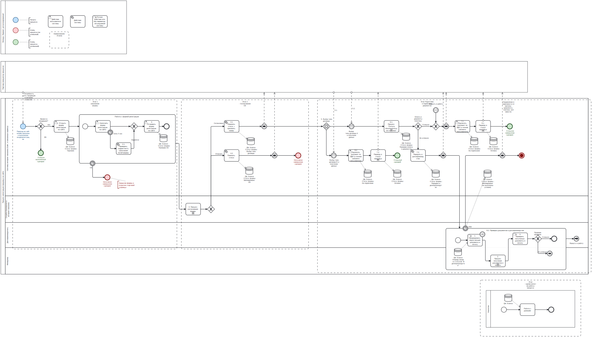
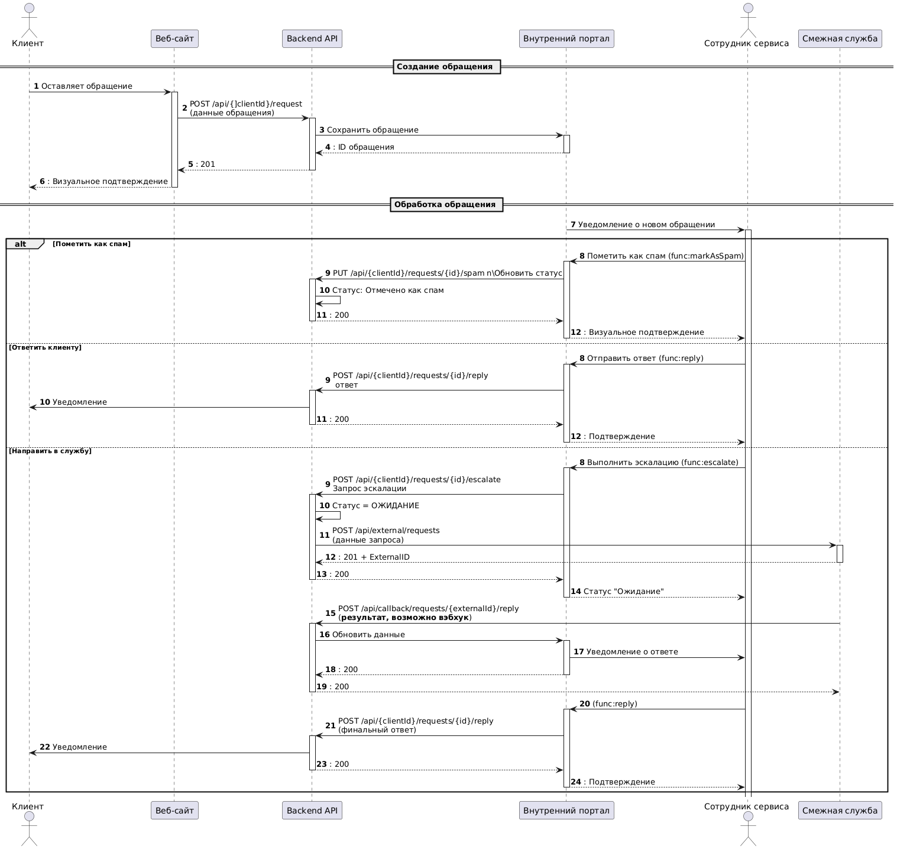

# Оглавление

- [Оглавление](#оглавление)
  - [Задание 1](#задание-1)
    - [Описание](#описание)
    - [Решение](#решение)
  - [Задание 2](#задание-2)
  - [Задание 3](#задание-3)
  - [Эндпоинт: /api/v1/bookings/{bookingId}](#эндпоинт-apiv1bookingsbookingid)
  - [Информация об исполнителе](#информация-об-исполнителе)

---
Задание: https://disk.yandex.ru/i/S8sf4VkzdDaT-Q

---

## Задание 1
### Описание
Нарисовать BPMN схему процесса.

Не уточненно - для каких целей эта BPMN Схема и кто будет основным пользователем (прим.: команда разработки\архитектор\стейкхолдер)
Исходя из того, что в требованиях указан навык работы с Camunda и по уровню детализацию задания могу предположить, что нужен баланс между понятностью и технической корректностью.

### Решение 

URL: https://disk.yandex.ru/d/rjWb5FwfGr4gyA

---

## Задание 2
Построить Sequence Диаграмму решения 

URL: https://disk.yandex.ru/d/D7PsrYRS6oOP9A

Версионирование в ендпоинтах не указывал но оно подразумевается(!)

---
## Задание 3
Возможно имеется ввиду продумать и запросы с ответами, но к сожалению через час в поезд (отпуск) а затягивать не хотел.  

1. Метод: PUT
Эндпоинт: /api/v1/users/{userId}
2. Метод: POST 
   Эндпоинт: /api/v1/bookings  
3. Метод: GET
   Эндпоинт: /api/v1/bookings/{bookingId}/?tickettype=avia
4. Метод: PATCH/PUT (в зависимости от полной или частичного обновления)
   Эндпоинт: /api/v1/bookings/{bookingId}  
---

## Информация об исполнителе
**ФИО:** Диянов Илья Павлович  
**Контактный номер:** +7 (989) 816-55-17  
**Email:** alwaysfor@yandex.ru  

